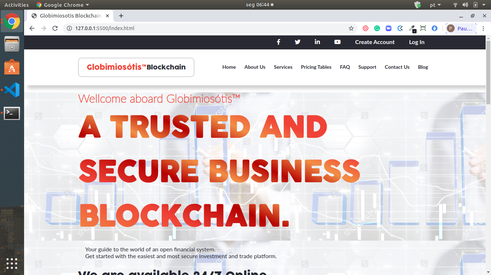
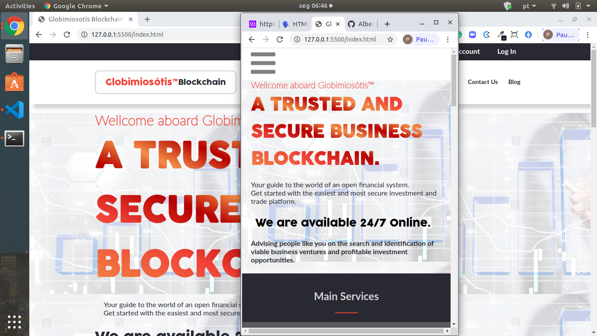
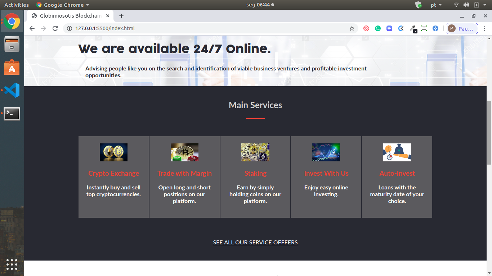
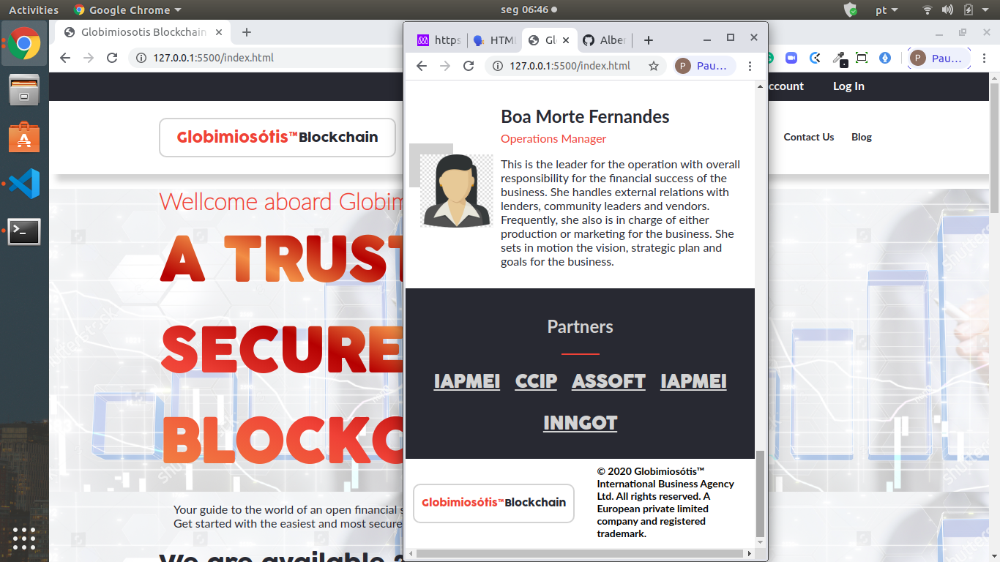

# CSS-HTML CAPSTONE PROJECT

> This is my HTML & CSS Capstone Project from the Microverse Man Curriculum. It is based on an online website for a conference. I followed the given design guidelines of the website concerning  colors, typographies (font face, size and weight), layout (composition and space between elements), for the two given screen sizes (mobile: up to 768px; and desktop: from 768px), and I built an investment management blockchain web page for Globimiosótis™ --a Portuguese private limited company and trademark, founded with the purpose of advising other companies that have plans to expand or internationalize their businesses on the search and identification of viable business ventures and investment opportunities, both locally and overseas.

This project consists of a website of eight pages, where only four of which contain content, by way of illustration, using real information from an existing company. Some information is only figurative.

The website was built with responsiveness, automatically adapting to both small and large screens. It was built from scratch using CSS and HTML, without using Frameworks. With the exception of images and some icons that contain other colors.
The use of colors and fonts was restricted to the three colors and two fonts required by Microverse. 
Regarding the layout, a greater approximation to the model presented was sought, but due to the need for customization, fulfilling the objectives of the project, some contents take the form of the author's creativity..

## Built With

- HTML
- CSS

## Live Demo

[Live Demo Link](https://rawcdn.githack.com/Albertino2020/html-css-capstone/3360c810e9b70ec2e76bb565b2ad861b1cac8be8/index.html)

## Authors

👤 Albertino Francisco

- Github: [@Albertino2020(https://github.com/Albertino2020)
- Twitter: [@albertino2050(https://twitter.com/albertino20150)
- Linkedin: [Albertino Francisco, PhD](https://linkedin.com/boamorte)

## 🤝 Contributing

Contributions, issues and feature requests are welcome!

Feel free to check the [issues page](issues/).

## Show your support

Give a ⭐️ if you like this project!

## Acknowledgments

This project was inspired by the website design of the 2015 Creative Commons Conference in Seoul, South Korea, which was designed and built by Cindy Shin,
GUI & Graphic Designer (website: http://www.cindyisworking.com), to whom I express my public thanks. 

## 📝 License

This project is [MIT](lic.url) licensed.
